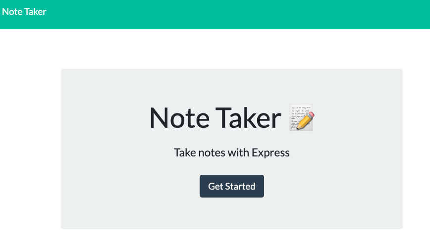
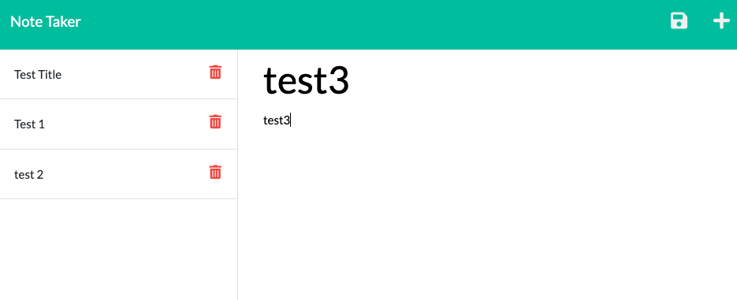

# Note Taker
Users can take notes and save it. If they would like to delete the notes, they can click the trash button.

### Github : https://github.com/fumixer/note-taker

### Deployed app : https://gentle-waters-75490.herokuapp.com/

### Screenshots

### Technologis:
* node.js
* npm
* inquire
* uuidv4
* Bootstrap

